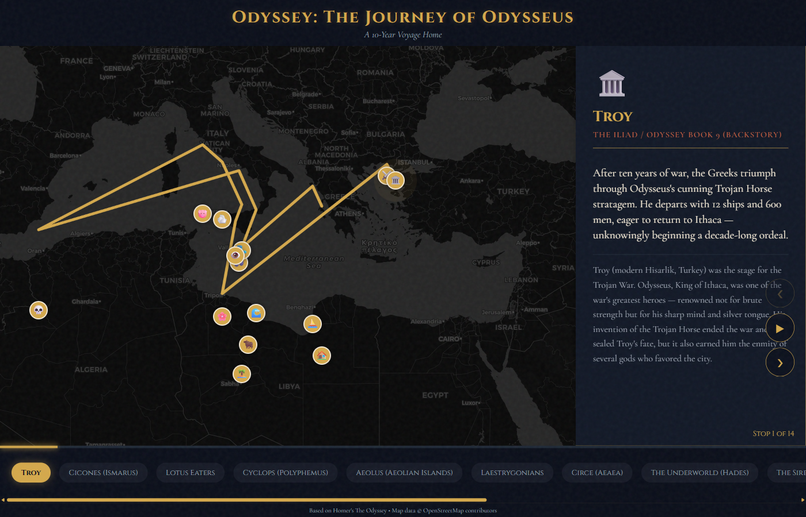

# Odyssey Map

An interactive infographic map of Odysseus's 10-year journey from Homer's *The Odyssey*, presented in chronological order with 14 stops from Troy to Ithaca.



## Features

- **Interactive Map**: Leaflet.js-powered map with dark CartoDB tiles
- **14 Chronological Stops**: From Troy to Ithaca, with detailed descriptions, statistics, and primary source references
- **Animated Journey Path**: The route draws itself on page load
- **Auto-Play Mode**: Sit back and watch the journey unfold
- **Timeline Navigation**: Jump to any stop via the timeline bar
- **Rich Content**: Each stop includes period, region, crew statistics, and citations from Homer, Strabo, Ovid, and more
- **Responsive Design**: Works on desktop and mobile

## Usage

**Live site**: [https://jasonycw.github.io/odyssey-map/](https://jasonycw.github.io/odyssey-map/)

Or clone and open `index.html` locally (requires internet for map tiles and fonts).

## Project Structure

```
odyssey-map/
├── index.html          # Main HTML structure
├── css/
│   └── style.css       # All styles and responsive layout
├── js/
│   ├── data.js         # Journey stops data with rich metadata
│   └── app.js          # Map application logic
├── screenshots/        # Verification screenshots
├── README.md
└── LICENSE
```

## Technology

- [Leaflet.js](https://leafletjs.com/) for interactive mapping
- CartoDB dark_matter tiles via OpenStreetMap
- Google Fonts (Cinzel + Cormorant Garamond)

## Data

Each stop includes:
- **Description & Detail**: Narrative overview of the episode
- **Period**: Timeline placement within the 10-year journey
- **Region**: Geographic location (ancient and modern)
- **Statistics**: Crew counts, ships remaining, distances, key metrics
- **Sources**: Citations from Homer's Odyssey, plus classical authors (Strabo, Ovid, Virgil, Pliny, Pausanias) and archaeological references

## License

MIT
